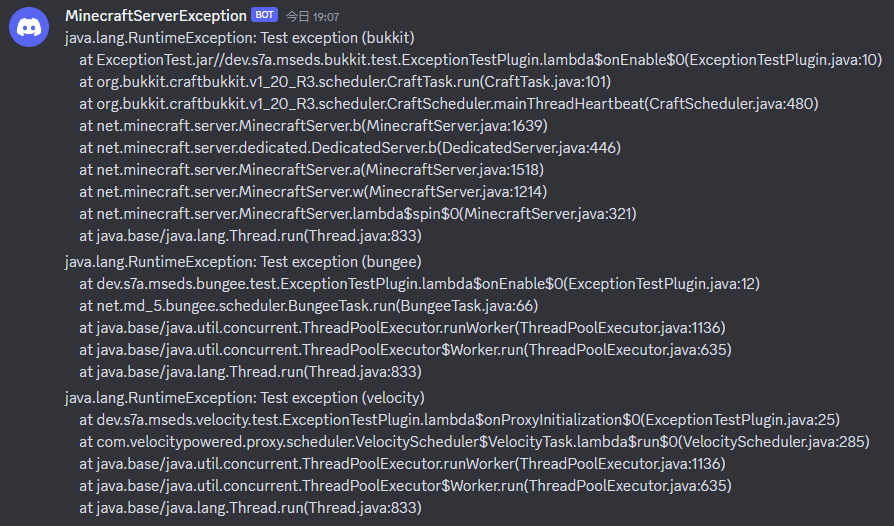
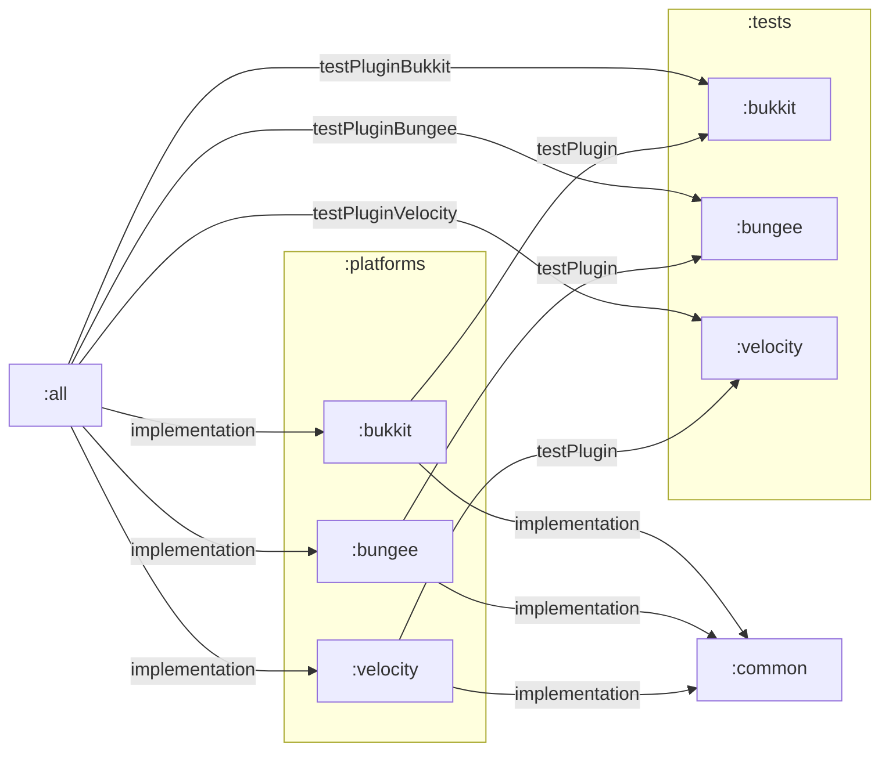

# MinecraftServerExceptionDiscordSender

Handle exceptions thrown by your Minecraft server and notify them using Discord webhook.



## Support platforms

- Bukkit
- BungeeCord
- Velocity

## Configurations

### Bukkit / BungeeCord

#### `plugins/MinecraftServerExceptionDiscordSender/config.yml`

```yaml
# Discord Webhook URL
# https://support.discord.com/hc/en-us/articles/228383668-Intro-to-Webhooks
webhook_url: ""
```

### Velocity

#### `plugins/minecraft-server-exception-discord-sender/config.toml`

```toml
# Discord Webhook URL
# https://support.discord.com/hc/en-us/articles/228383668-Intro-to-Webhooks
webhook_url = ""
```

## Releases

> **Files**
>
> - `MinecraftServerExceptionDiscordSender.jar` : Support all platforms
> - `MinecraftServerExceptionDiscordSender-bukkit.jar` : Support Bukkit only
> - `MinecraftServerExceptionDiscordSender-bungee.jar` : Support BungeeCord only
> - `MinecraftServerExceptionDiscordSender-velocity.jar` : Support Velocity only

### [v1.0.2 (latest)](https://github.com/wanko-zushi/MinecraftServerExceptionDiscordSender/releases/tag/1.0.2)

#### Feature

- Use custom username


### [v1.0.1](https://github.com/wanko-zushi/MinecraftServerExceptionDiscordSender/releases/tag/1.0.1)

#### Bug fix

- Support StackOverflowException
  - Consider content limits for Discord webhooks

### [v1.0.0](https://github.com/wanko-zushi/MinecraftServerExceptionDiscordSender/releases/tag/1.0.0)

- First release :tada:

## For developers

### Project structure


