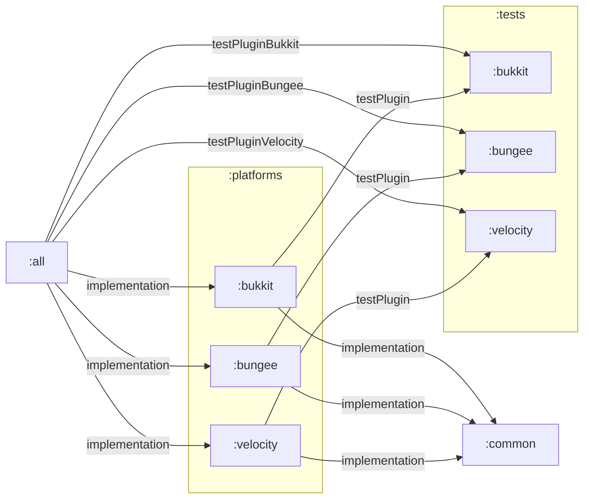

# MinecraftServerExceptionDiscordSender

Handle exceptions thrown by your Minecraft server and notify them using Discord webhook.


## Support platforms

- Bukkit
- BungeeCord
- Velocity

## Nonblocking notification hotfix

`1.0.0-hotfix.1` keeps the existing webhook configuration. Logging threads only format
an immutable message of at most 2,000 characters and offer it to a queue of at most
128 messages; they never perform HTTP I/O or wait for queue capacity. A single
daemon worker sends notifications. Identical formatted exceptions are aggregated
for 60 seconds; the recent-message cache is bounded to 1,024 entries.

HTTP connections use a 3-second connect timeout and a 5-second read timeout.
HTTP 429 honors `Retry-After` / Discord's `retry_after`, with at most one retry per
notification. A second 429 also delays the next queued notification. Queue overflow
discards the new notification. Plain, rate-limited local counters report discarded,
aggregated, and failed notifications without recording the webhook URL or throwing
notification failures back into the logging thread. Other server logging is unchanged.

`setup()` is idempotent. The sender implements `AutoCloseable`; `close()` stops
accepting notifications, removes its appenders, discards waiting notifications,
cancels active HTTP I/O, and stops its worker. Bukkit, BungeeCord, and Velocity invoke
this cleanup during shutdown. An already closed sender cannot be restarted; create
a new instance after closing it.

Build and run the regression tests with Java 21 and the existing Gradle 8.5 wrapper:

```shell
./gradlew --no-daemon :common:test build
```

The tests use local mock endpoints, including stalled responses, 429, queue overflow,
and shutdown; no production Discord request is made. The legacy test-server download
tasks are configured lazily so normal builds do not call the retired Paper download
API. The unavailable BungeeCord 1.19 snapshot is replaced by the published 1.20-R0.1
compile-only API, excluding its unavailable and unused Brigadier snapshot. Neither
is bundled in any plugin. Other existing dependency versions are preserved.

## Configurations

### Bukkit / BungeeCord

#### `plugins/MinecraftServerExceptionDiscordSender/config.yml`

```yaml
# Discord Webhook URL
# https://support.discord.com/hc/en-us/articles/228383668-Intro-to-Webhooks
webhook_url: ""
```

### Velocity

#### `plugins/minecraft-server-exception-discord-sender/config.toml`

```toml
# Discord Webhook URL
# https://support.discord.com/hc/en-us/articles/228383668-Intro-to-Webhooks
webhook_url = ""
```

## Releases

> **Files**
>
> - `MinecraftServerExceptionDiscordSender.jar` : Support all platforms
> - `MinecraftServerExceptionDiscordSender-bukkit.jar` : Support Bukkit only
> - `MinecraftServerExceptionDiscordSender-bungee.jar` : Support BungeeCord only
> - `MinecraftServerExceptionDiscordSender-velocity.jar` : Support Velocity only

### [v1.0.2 (latest)](https://github.com/wanko-zushi/MinecraftServerExceptionDiscordSender/releases/tag/1.0.2)

#### Feature

- Use custom username


### [v1.0.1](https://github.com/wanko-zushi/MinecraftServerExceptionDiscordSender/releases/tag/1.0.1)

#### Bug fix

- Support StackOverflowException
  - Consider content limits for Discord webhooks

### [v1.0.0](https://github.com/wanko-zushi/MinecraftServerExceptionDiscordSender/releases/tag/1.0.0)

- First release :tada:

## For developers

### Project structure


```mermaid
flowchart LR
    :all
    subgraph :platforms 
        :platform-bukkit[":bukkit"]
        :platform-bungee[":bungee"]
        :platform-velocity[":velocity"]
    end
    :common
    subgraph :tests
      :test-bukkit[":bukkit"]
      :test-bungee[":bungee"]
      :test-velocity[":velocity"]
    end
    
    :all --"implementation"--> :platform-bukkit
    :all --"implementation"--> :platform-bungee
    :all --"implementation"--> :platform-velocity
    :all --"testPluginBukkit"--> :test-bukkit
    :all --"testPluginBungee"--> :test-bungee
    :all --"testPluginVelocity"--> :test-velocity
    :platform-bukkit --"testPlugin"--> :test-bukkit
    :platform-bungee --"testPlugin"--> :test-bungee
    :platform-velocity --"testPlugin"--> :test-velocity
    :platform-bukkit --"implementation"--> :common
    :platform-bungee --"implementation"--> :common
    :platform-velocity --"implementation"--> :common
```
