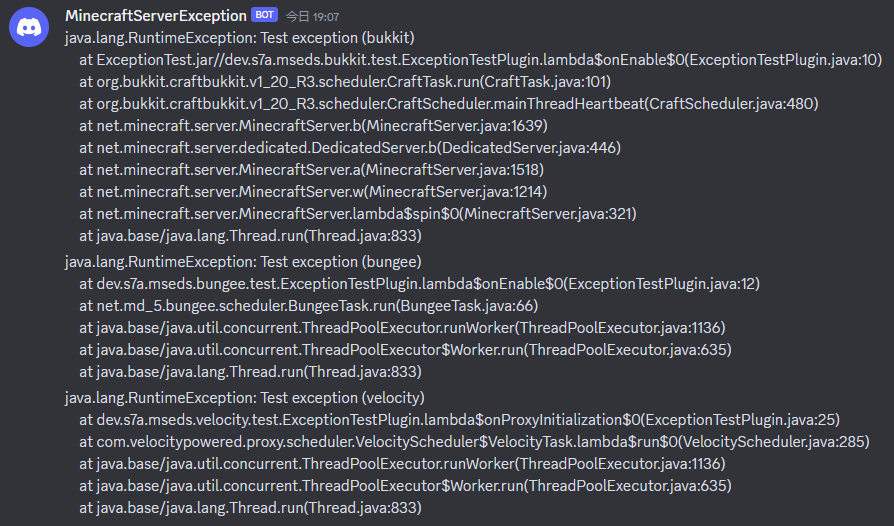
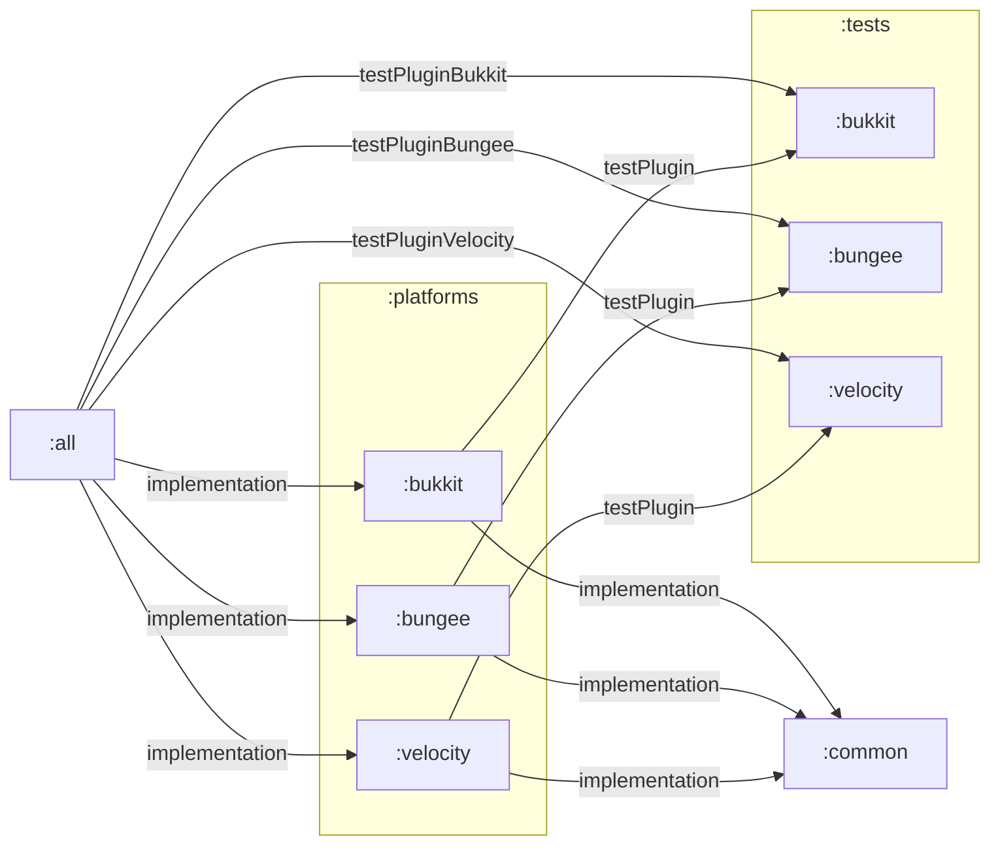

# MinecraftServerExceptionDiscordSender

Handle exceptions thrown by your Minecraft server and notify them using Discord webhook.



## Support platforms

- Bukkit
- BungeeCord
- Velocity

## Configurations

### Bukkit / BungeeCord

#### `plugins/MinecraftServerExceptionDiscordSender/config.yml`

```yaml
# Discord Webhook URL
# https://support.discord.com/hc/en-us/articles/228383668-Intro-to-Webhooks
webhook_url: ""
```

### Velocity

#### `plugins/minecraft-server-exception-discord-sender/config.toml`

```toml
# Discord Webhook URL
# https://support.discord.com/hc/en-us/articles/228383668-Intro-to-Webhooks
webhook_url = ""
```

## Releases

> **Files**
>
> - `MinecraftServerExceptionDiscordSender.jar` : Support all platforms
> - `MinecraftServerExceptionDiscordSender-bukkit.jar` : Support Bukkit only
> - `MinecraftServerExceptionDiscordSender-bungee.jar` : Support BungeeCord only
> - `MinecraftServerExceptionDiscordSender-velocity.jar` : Support Velocity only

### [v1.0.3 (latest)](https://github.com/wanko-zushi/MinecraftServerExceptionDiscordSender/releases/tag/1.0.3)

#### Bug fix

- Send webhook notifications asynchronously
- Add connection and read timeouts
- Respect rate limits and retry once
- Group duplicate exceptions for 60 seconds
- Limit pending notifications to 128
- Release notification resources when the server stops

### [v1.0.2](https://github.com/wanko-zushi/MinecraftServerExceptionDiscordSender/releases/tag/1.0.2)

#### Feature

- Use custom username


### [v1.0.1](https://github.com/wanko-zushi/MinecraftServerExceptionDiscordSender/releases/tag/1.0.1)

#### Bug fix

- Support StackOverflowException
  - Consider content limits for Discord webhooks

### [v1.0.0](https://github.com/wanko-zushi/MinecraftServerExceptionDiscordSender/releases/tag/1.0.0)

- First release :tada:

## For developers

### Build

Use Java 21 and the Gradle wrapper.

```shell
./gradlew build
```

### Tests

```shell
./gradlew :common:test
```

The tests use local webhook endpoints.

### Project structure


```mermaid
flowchart LR
    :all
    subgraph :platforms 
        :platform-bukkit[":bukkit"]
        :platform-bungee[":bungee"]
        :platform-velocity[":velocity"]
    end
    :common
    subgraph :tests
      :test-bukkit[":bukkit"]
      :test-bungee[":bungee"]
      :test-velocity[":velocity"]
    end
    
    :all --"implementation"--> :platform-bukkit
    :all --"implementation"--> :platform-bungee
    :all --"implementation"--> :platform-velocity
    :all --"testPluginBukkit"--> :test-bukkit
    :all --"testPluginBungee"--> :test-bungee
    :all --"testPluginVelocity"--> :test-velocity
    :platform-bukkit --"testPlugin"--> :test-bukkit
    :platform-bungee --"testPlugin"--> :test-bungee
    :platform-velocity --"testPlugin"--> :test-velocity
    :platform-bukkit --"implementation"--> :common
    :platform-bungee --"implementation"--> :common
    :platform-velocity --"implementation"--> :common
```
